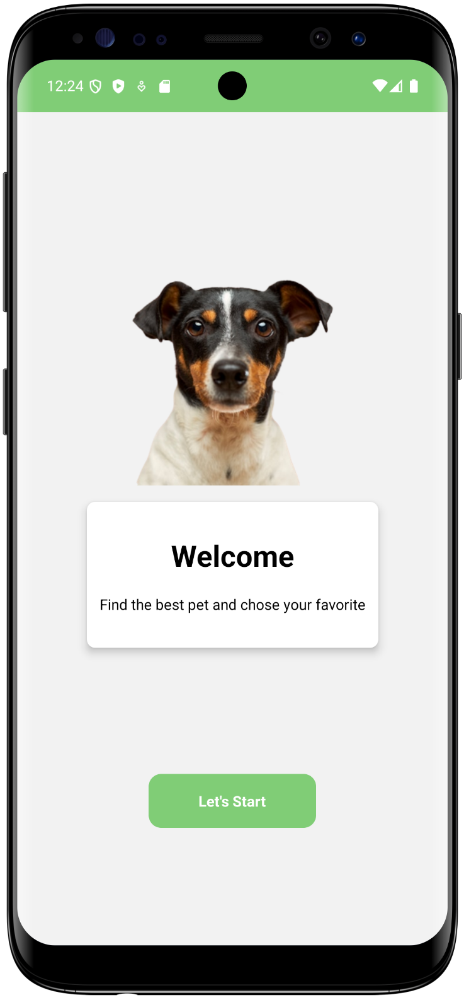
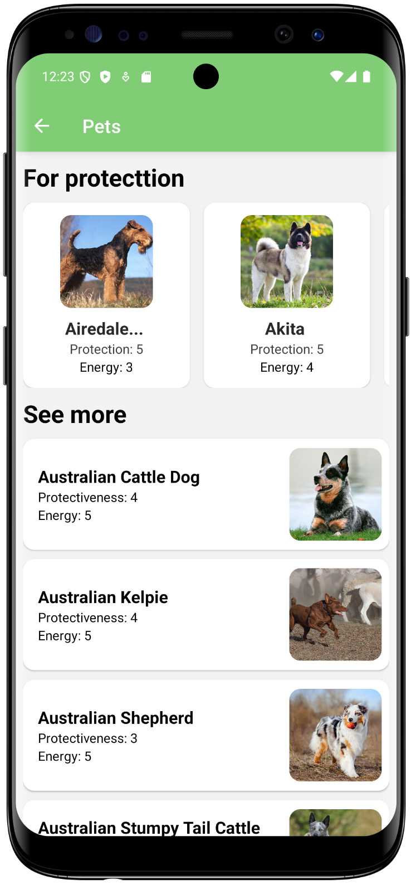
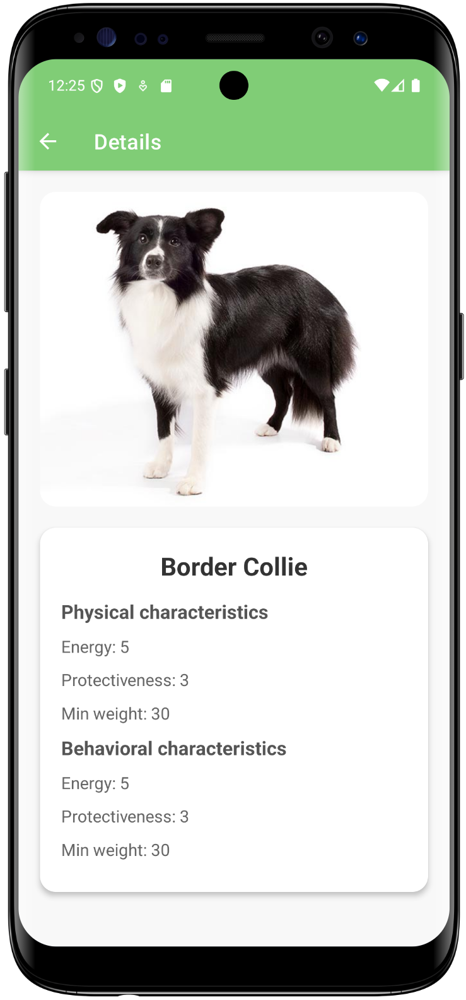

# Dog Book

An app that provides information about dog breeds.

## Table of Contents

- [Description](#description)
- [Features](#features)
- [Technologies](#technologies)
- [Screenshots](#screenshots)
- [Installation](#installation)
- [Usage](#usage)
- [Contact](#contact)

## Description

Dog Book is an application designed to help users find information about various dog breeds, making it easier to adopt the right dog for them. The app provides detailed descriptions, images, and other important information about each breed.

## Features

- Find information about different dog breeds
- View detailed descriptions and images of dog breeds
- Search for dog breeds suitable for adoption

## Technologies

- React Native
- Expo
- Axios
- API Ninjas

## Screenshots

Here are some screenshots of the application:

- Home<br>
  
- Dog List<br>
  
- Dog Details<br>
  

## Installation

To run this project, follow these steps:

1. Clone the repository:
    ```bash
    git clone https://github.com/jordanwmp/dogbook/tree/master.git
    ```

2. Navigate to the project directory:
    ```bash
    cd dog-book
    ```

3. Install the dependencies:
    ```bash
    npm install
    ```

4. Start the development server with Expo:
    ```bash
    expo start
    ```

## Usage

Once the server is running, use the Expo app on your device or an emulator to view the Dog Book app. Browse through different dog breeds, view their details, and find the perfect dog to adopt.

